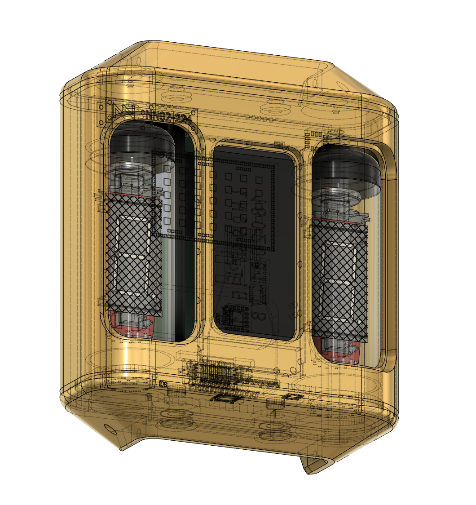

<p align="center"></p>

<h1 align="center"> Viking watch</h1>

<p align="center"> A beautiful time piece combining old and new tech</p>

<p align="center"></p>

<p> Viking watch from Tordesign </p>

<h3> List of features </h3>

<ul>
  <li>VFD tubes </li>
  <li>OLED screen </li>
  <li>Step counter</li>
  <li>GPS</li>
</ul>


<h3> Code Demo </h3>

```html

For uploading using mcumgr and mcuboot use the following commands:

sudo -isert-path/mcumgr --conntype=serial --connstring='/dev/cu.usbserial-DK0GXIQW,baud=115200' xxxx
1. replace xxxx with "image list"
2. replace xxxx with "image upload app_update.bin"
3. replace xxxx with "image test + hash"
4. replace xxxx with "reset"
5. replace xxxx with "image confirm + hash"

```

<h3>Contributing</h3>
Keep it simple. Keep it minimal. Don't put every single feature just because you can.

<h3>Authors or Acknowledgments</h3>
<ul>
  <li>Tor K. Gjerde</li>
</ul>

<h3>License</h3>

copyright tordesign.net